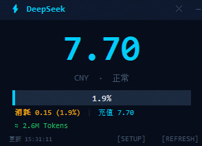

# ⚡ DeepSeek Balance Widget

桌面余额挂件 — 实时显示 DeepSeek API 账户余额与消耗进度。

**适配 DeepSeek 接入工具：**
> 🖥️ **Codex 桌面端** · **Codex CLI** · **其他支持 DeepSeek API 的应用**


---

## ✨ 功能

| 功能 | 说明 |
|------|------|
| 💰 **余额显示** | 实时查询 DeepSeek 账户余额 |
| 📊 **消耗进度条** | 可视化已用额度占总充值额的比例 |
| 🔄 **自动刷新** | 每 30 秒自动更新 |
| ⌨️ **全局热键** | `Ctrl + Alt + D` 随时显示/隐藏窗口 |
| 🎨 **赛博科技风** | 深色主题，电光蓝配色 |
| 🪟 **置顶显示** | 始终在其他窗口之上，可拖动 |
| 📦 **零依赖** | 仅需 Python 3 标准库，无需 pip install |

## 📷 预览



## 🚀 快速开始

### 环境要求

- **Windows** 系统（Linux/macOS 未测试但理论上可运行）
- **Python 3.8+** 已安装并加入 PATH

### 下载

```bash
git clone https://github.com/ZJ55668899/deepseek-balance-widget.git
cd deepseek-balance-widget
```

或者直接下载 ZIP 解压。

### 启动

**方式一：双击运行（推荐）**

双击 `start_widget.bat`，后台无窗口启动。

**方式二：命令行**

```bash
pythonw ds_balance_widget.py      # 后台无窗口
python  ds_balance_widget.py      # 带控制台输出
```

## 🔑 配置 API Key

1. 打开 [platform.deepseek.com/api_keys](https://platform.deepseek.com/api_keys)
2. 创建一个 API Key
3. 右键挂件 → **[SETUP]** → 输入 API Key → 保存

API Key 将保存在本地的 `.ds_widget/config.json` 文件中。

## ⌨️ 操作

| 操作 | 效果 |
|------|------|
| **鼠标拖动** | 移动挂件位置 |
| **右键菜单** | 刷新 / 设置 / 置顶 / 隐藏 / 退出 |
| **双击标题栏** | 打开设置 |
| **— 按钮** | 隐藏窗口 |
| **Ctrl + Alt + D** | 全局热键，显示/隐藏窗口 |
| **Esc** | 退出 |

## 📁 文件结构

```
deepseek-balance-widget/
├── ds_balance_widget.py    # 主程序
├── start_widget.bat        # 启动脚本（双击运行）
├── .ds_widget/
│   └── config.json         # API Key 配置文件（自动生成）
└── README.md
```

## 📊 数据说明

| 数据项 | 来源 |
|--------|------|
| 当前余额 | DeepSeek `/user/balance` API |
| 充值余额 | 当前余额中的充值部分（蓝色） |
| 赠送余额 | 当前余额中的免费赠送部分（紫色） |

> **Token 用量**：DeepSeek 未提供查询历史 Token 用量的公开 API，如需查看请前往 [DeepSeek 控制台](https://platform.deepseek.com) → 用量 → 导出 CSV。

## 🔗 适用场景

本挂件可配合任何使用 **DeepSeek API** 的应用，实时监控账户余额消耗情况。

### 热门推荐 🔥

| 应用 | 类型 | 说明 |
|------|------|------|
| **Codex 桌面端** | 🖥️ 桌面 | 接入 DeepSeek 后实时查看余额消耗 |
| **Codex CLI** | ⌨️ CLI | 命令行接入 DeepSeek，边用边看余额 |

### 🖥️ 桌面端

| 应用 | 说明 |
|------|------|
| **[ChatBox](https://chatboxai.app)** | 桌面 AI 客户端，支持自定义 API 端点 |
| **[Cherry Studio](https://cherrystudio.app)** | 开源桌面 AI 客户端，支持 DeepSeek |
| **[LobeChat](https://lobehub.com)** | 现代化 AI 聊天桌面端 |
| **[NextChat](https://nextchat.dev)** | ChatGPT Next Web，可配置 DeepSeek API |
| **[Open WebUI](https://openwebui.com)** | 自托管 AI 界面 |

### ⌨️ CLI / 开发工具

| 工具 | 说明 |
|------|------|
| **[Aider](https://aider.chat)** | AI 结对编程工具，支持 DeepSeek |
| **[Continue](https://continue.dev)** | VS Code / JetBrains AI 插件 |
| **[Open Interpreter](https://openinterpreter.com)** | 自然语言终端 |
| **[Cline](https://github.com/cline/cline)** | VS Code 扩展，支持 DeepSeek |

> 💡 简单来说：**只要用 DeepSeek API Key 的地方，就能用这个挂件看余额。**

## 🛠 技术细节

- 纯 **Python 3 标准库**（tkinter / urllib / json / threading），零外部依赖
- 全局热键通过 Windows `RegisterHotKey` API 实现
- 单例运行通过文件锁 + PID 检查确保
- 窗口采用 `overrideredirect` + `WS_EX_TOOLWINDOW` 实现无边框置顶挂件

## 📄 License

MIT
